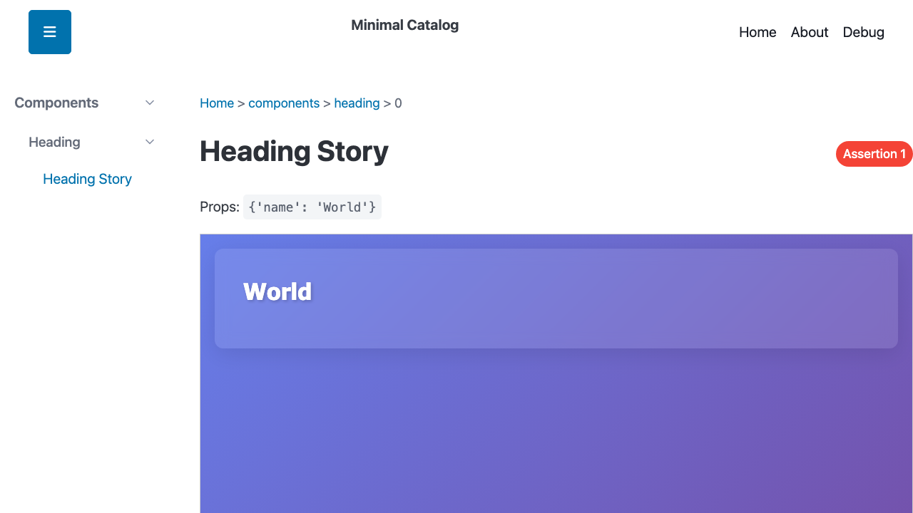

# 📖 Storyville ✨

**Visual, story-based component development for Python 3.14+**

[](https://www.python.org/downloads/)
[](https://opensource.org/licenses/MIT)
[](https://github.com/pauleveritt/storyville)
[](https://pauleveritt.github.io/storyville/)
[](https://github.com/astral-sh/ruff)
[](https://github.com/DetachHead/basedpyright)
[](https://github.com/pauleveritt/t-strings)

---

## 🎯 What is Storyville?

Storyville is a **visual, component-driven development (CDD)** system for Python that helps you build, document, and
test
components in isolation. Write stories to express component variations, browse them in a live catalog, and automatically
generate tests from assertions.

> 💡 **Think Storybook.js for Python** — but with native Python 3.14+ features, hot reload via subinterpreters, and
> automatic pytest integration!

### 🌟 Perfect for:

- 🎨 **Building component libraries** with tdom
- 👀 **Visual component development** and documentation
- ✅ **Test-driven component design**
- 🔥 **Hot-reloading Python modules** during development

---

## ✨ Key Features

<table>
<tr>
<td width="50%">

### 🎨 **Component Catalog**

- 🌐 Browse components and their variations in a live web interface
- 💅 PicoCSS-based clean, responsive UI
- ⚡ Real-time hot reload with subinterpreter isolation
- 📂 Hierarchical organization: Catalog → Section → Subject → Story

</td>
<td width="50%">

### 🧪 **Story Assertions**

- ✍️ Define assertions directly on stories
- ✅❌ Visual pass/fail badges in the browser
- 🤖 Automatic pytest test generation (zero boilerplate)
- 📊 Rich failure reporting with HTML diffs

</td>
</tr>
<tr>
<td width="50%">

### ⚡ **Hot Reload with Subinterpreters**

- 🐍 Python 3.14+ subinterpreter pool for true module reloading
- ⏱️ Instant updates when you save `stories.py` files
- 🚫 No server restarts needed
- 💾 Maintains state across rebuilds

</td>
<td width="50%">

### 🔬 **pytest Plugin**

- 🔍 Automatically discovers stories with assertions
- 📝 Generates one test per assertion
- 🏷️ Clear test naming: `test_story[catalog.section.subject.story::assertion]`
- 🔀 Works with pytest-xdist for parallel execution
- 🆕 Fresh rendering per test for proper isolation

</td>
</tr>
<tr>
<td colspan="2">

### 🎨 **Themed Stories**

- 🎭 Preview components within custom-themed layouts
- 🖼️ Isolated iframe rendering for visual separation
- 🎯 Catalog-level theme configuration with automatic fallback
- 📄 Full HTML document control for real-world context
- 🎨 Perfect for matching your project's design system

</td>
</tr>
</table>

---

## 📦 Installation

```bash
# Requires Python 3.14+
pip install storyville
```

> ⚠️ **Note:** Storyville requires Python 3.14+ for subinterpreter support and modern type syntax.

<details>
<summary>📸 <strong>See it in action!</strong></summary>



*Browse components, view stories, and see assertion results in real-time*

</details>

## 🎮 Try It

Want to play around? Use the `seed` command to generate a fake catalog, then view it.

```bash
$ cd [some temp dir]
$ uvx storyville seed small my_catalog
$ PYTHONPATH=. uvx storyville serve my_catalog
```

Then open `http://localhost:8080` in your browser. Edit files in `my_catalog` and see the updates.

## 🚀 Quick Start

### 1. Create a Component

```python
# my_package/components/button/button.py
from tdom import html


def Button(text: str, variant: str = "primary"):
    """A simple button component."""
    return html(t"<button class={variant}>{text}</button>")
```

### 2. Write Stories

```python
# my_package/components/button/stories.py
from my_package.components.button.button import Button
from storyville import Story, Subject
from storyville.assertions import GetByTagName


def this_subject() -> Subject:
    return Subject(
        title="Button Component",
        target=Button,
        items=[
            # Story with assertions
            Story(
                props=dict(text="Click Me", variant="primary"),
                assertions=[GetByTagName(tag="button")],
            ),
            # More variations...
            Story(props=dict(text="Cancel", variant="danger")),
        ],
    )
```

### 3. Generate an Example Catalog (Optional)

New to Storyville? Generate a complete example catalog to learn from:

```bash
# Generate a small example catalog
storyville seed small my_catalog

# Or try medium or large catalogs
storyville seed medium my_catalog
storyville seed large my_catalog
```

**Catalog Sizes:**

- **small**: 1 section, 2-3 subjects, 2 stories per subject (4-6 total stories)
- **medium**: 2-3 sections, 4-6 subjects, 2-3 stories per subject (12-18 total stories)
- **large**: 4-5 sections, 8-12 subjects, 3-4 stories per subject (30-40 total stories)

The generated catalog is a complete Python package with:

- Diverse component examples (Button, Card, Form, Badge, etc.)
- Story assertions demonstrating testing patterns
- Custom ThemedLayout showing layout customization
- Ready to serve and build immediately

### 4. Start the Dev Server

```bash
storyville serve my_package
# Opens http://localhost:8080
# Hot reload enabled by default!
```

For generated catalogs:

```bash
storyville serve my_catalog
# Browse the example components and stories
```

### 5. Build Static Catalog

```bash
storyville build my_catalog dist/
# Generates static HTML in dist/ directory
```

### 6. Add Custom Theming (Optional)

```python
# my_package/themed_layout/themed_layout.py
from dataclasses import dataclass
from tdom import Node, html


@dataclass
class ThemedLayout:
    story_title: str | None
    children: Node | None

    def __call__(self) -> Node:
        """Render the themed layout using tdom t-string."""
        title_text = self.story_title if self.story_title else "Story"

        return html(t'''
<!DOCTYPE html>
<html lang="en">
<head>
    <meta charset="utf-8" />
    <meta name="viewport" content="width=device-width, initial-scale=1" />
    <title>{title_text}</title>
    <style>
        body {{
            background: linear-gradient(135deg, #667eea 0%, #764ba2 100%);
            font-family: system-ui;
            margin: 0;
            padding: 20px;
        }}
        .story-wrapper {{
            max-width: 900px;
            margin: 0 auto;
            background: rgba(255, 255, 255, 0.95);
            padding: 40px;
            border-radius: 12px;
        }}
    </style>
</head>
<body>
    <div class="story-wrapper">
        {self.children}
    </div>
</body>
</html>
''')


# my_package/stories.py
from tdom import Node
from storyville import Catalog
from my_package.themed_layout.themed_layout import ThemedLayout


def themed_layout_wrapper(story_title: str | None = None, children: Node | None = None) -> Node:
    """Wrapper function to create and call ThemedLayout instances."""
    layout = ThemedLayout(story_title=story_title, children=children)
    return layout()


def this_catalog() -> Catalog:
    return Catalog(themed_layout=themed_layout_wrapper)
```

### 7. Run Tests

```bash
# Configure pytest in pyproject.toml
[tool.pytest.ini_options]
testpaths = ["tests", "my_package"]

[tool.storyville.pytest]
enabled = true

# Run tests
pytest my_package/
# Auto-generates tests from story assertions!
```

### 8. Assertion Helpers (Recommended)

Storyville provides declarative assertion helpers that wrap aria-testing queries for clean, reusable component
assertions:

```python
# my_package/components/button/stories.py
from my_package.components.button.button import Button
from storyville import Story, Subject
from storyville.assertions import GetByTagName, GetByText, GetByRole


def this_subject() -> Subject:
    return Subject(
        title="Button Component",
        target=Button,
        items=[
            Story(
                title="Primary Button",
                props=dict(text="Click Me", variant="primary"),
                assertions=[
                    # Element exists
                    GetByTagName(tag_name="button"),
                    # Text content verification
                    GetByTagName(tag_name="button").text_content("Click Me"),
                    # Attribute checks
                    GetByTagName(tag_name="button").with_attribute("class", "primary"),
                ],
            ),
            Story(
                title="No Login Button",
                props=dict(text="Submit", variant="primary"),
                assertions=[
                    # Negative assertion - element should NOT exist
                    GetByText(text="Login").not_(),
                ],
            ),
        ],
    )
```

**Single Element Query Helpers:**

- `GetByRole(role="button")` - Find by ARIA role
- `GetByText(text="Submit")` - Find by text content
- `GetByLabelText(label="Email")` - Find form inputs by label
- `GetByTestId(test_id="submit-btn")` - Find by test ID
- `GetByClass(class_name="btn-primary")` - Find by CSS class
- `GetById(id="main-content")` - Find by element ID
- `GetByTagName(tag_name="button")` - Find by HTML tag

**Fluent API Modifiers:**

- `.not_()` - Assert element does NOT exist
- `.text_content(expected)` - Verify element text
- `.with_attribute(name, value)` - Check element attribute

**Method Chaining:**

```python
# Chain multiple checks
GetByTagName(tag_name="button")
    .text_content("Save")
    .with_attribute("type", "submit")
```

**List-Oriented Query Helpers (GetAllBy*):**

For assertions involving multiple elements, use the `GetAllBy*` helpers:

```python
from storyville.assertions import GetAllByRole, GetAllByText, GetAllByClass

Story(
    title="Navigation Menu",
    props=dict(items=["Home", "About", "Contact"]),
    assertions=[
        # Verify count of elements
        GetAllByRole(role="listitem").count(3),

        # Select specific element and verify its properties
        GetAllByRole(role="listitem").nth(0).text_content("Home"),
        GetAllByRole(role="listitem").nth(1).text_content("About"),

        # Chain count with other operations
        GetAllByClass(class_name="nav-item").count(3),

        # Select element and check its attributes
        GetAllByText(text="Contact").nth(0).with_attribute("href", "/contact"),
    ],
)
```

**Available List Query Helpers:**

- `GetAllByRole(role="button")` - Find all elements with ARIA role
- `GetAllByText(text="Item")` - Find all elements with text
- `GetAllByLabelText(label="Option")` - Find all labeled elements
- `GetAllByTestId(test_id="card")` - Find all elements by test ID
- `GetAllByClass(class_name="item")` - Find all elements with CSS class
- `GetAllByTagName(tag_name="li")` - Find all elements with HTML tag

**List Query Operations:**

- `.count(expected)` - Assert exact number of elements found
- `.nth(index)` - Select nth element (0-indexed) for further checks
- After `.nth()`, you can chain `.text_content()` and `.with_attribute()`

**Example with Complete Workflow:**

```python
from storyville.assertions import GetAllByTagName, GetAllByClass

Story(
    title="Product List",
    props=dict(products=[...]),
    assertions=[
        # Assert we have exactly 5 products
        GetAllByClass(class_name="product-card").count(5),

        # Verify first product details
        GetAllByClass(class_name="product-card")
            .nth(0)
            .text_content("Product 1"),

        # Verify all buttons are present
        GetAllByTagName(tag_name="button").count(5),

        # Check specific button attributes
        GetAllByTagName(tag_name="button")
            .nth(2)
            .with_attribute("type", "button"),
    ],
)
```

All helpers are **frozen dataclasses** ensuring immutability and type safety. They integrate seamlessly with
Story.assertions and pytest test generation.

## 📚 Documentation

- **[Getting Started](getting-started)** - Installation and first steps
- **[Writing Stories](writing-stories)** - Component stories and assertions
- **[Themed Stories](themed-stories)** - Custom layouts and design system integration
- **[pytest Plugin](pytest-plugin)** - Automatic test generation
- **[Hot Reload](hot-reload)** - Subinterpreter architecture
- **[CLI Reference](cli-reference)** - Command-line interface documentation
- **[API Reference](api-reference)** - Complete API documentation

---

## 🏗️ Architecture Highlights

### 🐍 Modern Python 3.14+

- ✨ **Type statement** for type aliases: `type AssertionCallable = Callable[[Element | Fragment], None]`
- 🔀 **PEP 604 union syntax**: `X | Y` instead of `Union[X, Y]`
- 🔍 **Structural pattern matching** for clean conditionals
- 🔄 **Subinterpreter pool** for true module isolation

### 🛠️ Built on Solid Foundations

| Technology        | Purpose                        |
|-------------------|--------------------------------|
| 🎯 **tdom**       | Templating and HTML generation |
| 🚀 **Starlette**  | Async web framework            |
| ✅ **pytest**      | Testing infrastructure         |
| 💅 **PicoCSS**    | Semantic CSS framework         |
| 👀 **watchfiles** | Fast file change detection     |

### 🌲 Tree Structure

```
📖 Catalog
  ├─ 📁 Section (optional grouping)
  │   └─ 🎯 Subject (component)
  │       ├─ 📄 Story (variation)
  │       └─ 📄 Story (with ✅ assertions)
  └─ 🎯 Subject
      └─ 📄 Story
```

---

## 🎯 Use Cases

| Use Case                       | Description                                                                            |
|--------------------------------|----------------------------------------------------------------------------------------|
| 📚 **Component Libraries**     | Build and document reusable components with all their variations in one place          |
| 🎨 **Design Systems**          | Create a browseable catalog of your design system components with live examples        |
| 🧪 **Test-Driven Development** | Write assertions alongside stories for immediate visual and automated testing feedback |
| 📖 **Living Documentation**    | Stories serve as both visual documentation and executable examples                     |

---

## 🤝 Contributing

Contributions are welcome! 🎉 This project uses modern Python tooling:

| Tool                | Purpose                  |
|---------------------|--------------------------|
| 📦 **uv**           | Dependency management    |
| 🧹 **ruff**         | Linting and formatting   |
| ✅ **pytest**        | Testing framework        |
| 🔍 **basedpyright** | Type checking            |
| 📚 **sphinx**       | Documentation generation |

### 🛠️ Development Setup

```bash
# Install dev dependencies (includes Sphinx)
uv sync --group dev

# Run tests
just test

# Type check
just typecheck

# Format code
just fmt

# Build documentation
cd docs && make html
```

### 📋 Contribution Guidelines

- ✅ All tests must pass
- 🔍 Type checking must succeed
- 🧹 Code must be formatted with ruff
- 📝 Add tests for new features
- 📚 Update documentation as needed

---

## 🛠️ Development Commands

This project uses [Just](https://just.systems/) as the preferred task runner for development workflows. Just recipes
provide a convenient, consistent interface for common development tasks.

**For contributors without Just installed**, direct command alternatives are provided below.

### Command Reference

| Just Recipe (Preferred) | Direct Command (Alternative)                        | Description                |
|-------------------------|-----------------------------------------------------|----------------------------|
| `just install`          | `uv sync --all-groups`                              | Install all dependencies   |
| `just setup`            | `uv sync --all-groups`                              | Alias for install          |
| `just lint`             | `uv run ruff check .`                               | Check code for issues      |
| `just fmt`              | `uv run ruff format .`                              | Format code automatically  |
| `just lint-fix`         | `uv run ruff check --fix .`                         | Lint and auto-fix issues   |
| `just typecheck`        | `uv run ty check`                                   | Run type checker           |
| `just test`             | `uv run pytest`                                     | Run tests (sequential)     |
| `just test-parallel`    | `uv run pytest -n auto`                             | Run tests (parallel)       |
| `just ci-checks`        | (see note below)                                    | Run all quality checks     |
| `just docs`             | `uv run sphinx-build -b html docs docs/_build/html` | Build documentation        |
| `just build`            | `uv build`                                          | Build package distribution |
| `just clean`            | (manual cleanup)                                    | Clean build artifacts      |

**Note on `just ci-checks`:** This recipe chains multiple commands with fail-fast behavior:

```bash
just install && just lint && just typecheck && just test-parallel
```

If running manually without Just, execute these commands in sequence and stop if any fails.

### Pre-Push Hook for Quality Checks

Storyville provides a pre-push Git hook to automatically run `just ci-checks` before pushing code. This prevents pushing
code that would fail CI checks.

**Install the hook:**

```bash
just enable-pre-push
```

**Disable the hook:**

```bash
just disable-pre-push
```

When enabled, the hook runs all quality checks (install, lint, typecheck, test-parallel) before each `git push`. If any
check fails, the push is aborted.

**How it works:**

- Creates `.git/hooks/pre-push` that invokes `just ci-checks`
- The hook only runs locally (not shared via git)
- Each developer can enable/disable independently
- Disabling removes executable permission without deleting the hook

**Tip:** Enable this hook to catch issues before they reach CI, saving time and keeping the commit history clean.

### Local Workflow Testing with `act`

You can test GitHub Actions workflows locally before pushing using the [act](https://github.com/nektos/act) tool:

**Installation (macOS):**

```bash
brew install act
```

**Basic Usage:**

```bash
# Run the CI tests workflow locally
act -j ci_tests --rm

# Run all workflows
act --rm
```

**Known Limitations:**

- Caching behavior may differ from GitHub Actions
- Some GitHub-specific features may not work identically
- Secret handling requires additional configuration
- Docker must be running on your system

For more information, see the [act documentation](https://github.com/nektos/act).

---

## 📄 License

MIT License - see [LICENSE](LICENSE) for details.

---

## 🔗 Links

| Resource            | URL                                                                                                    |
|---------------------|--------------------------------------------------------------------------------------------------------|
| 🏠 **Repository**   | [github.com/pauleveritt/storyville](https://github.com/pauleveritt/storyville)                         |
| 🐛 **Issues**       | [github.com/pauleveritt/storyville/issues](https://github.com/pauleveritt/storyville/issues)           |
| 📝 **Discussions**  | [github.com/pauleveritt/storyville/discussions](https://github.com/pauleveritt/storyville/discussions) |
| 🎯 **tdom Project** | [github.com/pauleveritt/t-strings](https://github.com/pauleveritt/t-strings)                           |

---

<div align="center">

**Made with 💜 by Paul Everitt**

⭐ **Star this repo if you find it useful!** ⭐

</div>
